# Servlets

Un servlet es un programa Java que se ejecuta en un servidor (normalmente de HTTP) y extiende su funcionalidad. Atiende peticiones recibidas desde los clientes y genera las respuestas.

## Ciclo de vida

### Inicializar el servlet

Cuando un servidor carga un servlet, ejecuta el **método init del servlet.** El proceso de inicialización debe completarse antes de poder manejar peticiones de los clientes, y antes de que el servlet sea destruido.

Aunque muchos servlets se ejecutan en servidores multi-thread, los servlets no tienen problemas de concurrencia durante su inicialización. El servidor llama sólo una vez al método init al crear la instancia del servlet, y no lo llamará de nuevo a menos que vuelva a recargar el servlet. El servidor no puede recargar un servlet sin primero haber destruido el servlet llamando al método destroy.

### Interactuar con los clientes

Después de la inicialización, el servlet puede dar servicio a las peticiones de los clientes. Estas peticiones serán atendidas por la misma instancia del servlet, por lo que hay que tener cuidado al acceder a variables compartidas, ya que podrían darse problemas de sincronización entre requerimientos simultáneos. Hablamos, entre otros, de los métodos:

1. doGet
2. doPost
3. doPut
4. doDelete

### Destruir el servlet

Los servlets se ejecutan hasta que el servidor los destruye, por cierre del servidor o bien a petición del administrador del sistema. Cuando un servidor destruye un servlet, ejecuta el método destroy del propio servlet. Este método sólo se ejecuta una vez y puede ser llamado cuando aún queden respuestas en proceso, por lo que hay que tener la atención de esperarlas. El servidor no ejecutará de nuevo el servlet hasta haberlo cargado e inicializado de nuevo.

En el código de la clase es el **método detroy**.

## ¿Cómo funciona un servlet?

Hasta ahora hemos creado aplicaciones J2SE, es decir aplicaciones para ejecutar en el equipo local.

Un **servlet** por sí mismo no tiene capacidad de ejecutarse, no tenemos
un método _main_ como hasta ahora.

El **servlet** se ejecuta dentro de un **_contenedor_** que es un servidor de aplicaciones. El contenedor será la verdadera aplicación que responde a las peticiones de los clientes (por ejemplo servicios REST, HTTP, etc.).

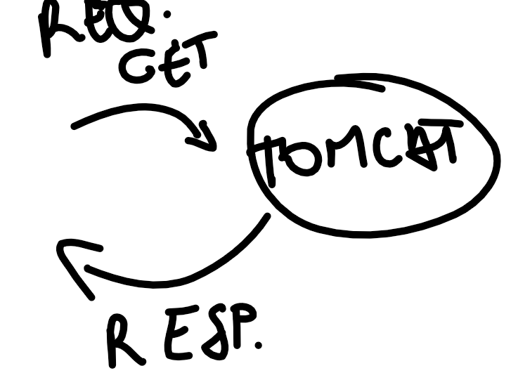

En función de _**la ruta de acceso al recurso**_ el servidor de aplicaciones cargará una u otra aplicación.

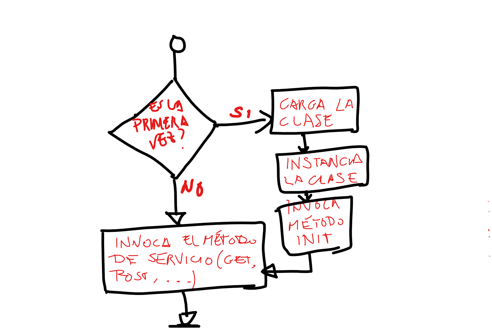

La primera vez que se invoque la ruta de nuestro servlet, éste será cargado e inicializado. Las siguientes veces ya estará en memoria y un hilo de ejecución invocará el método correspondiente.

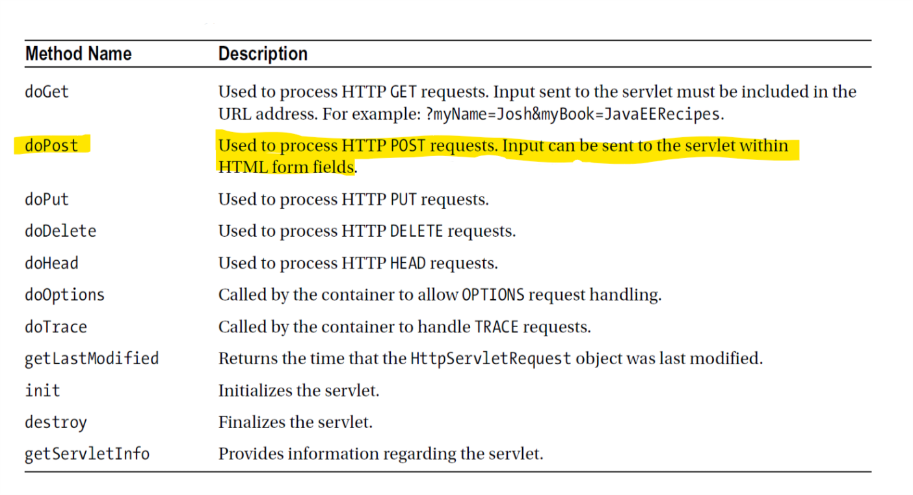

## Preparando el entorno

Para crear el proyecto vamos a usar Netbeans IDE y el servidor de aplicaciones J2EE Tomcat.

Partimos que ya hemos descargado e instalado NetBeans.


## Creando el proyecto

Seleccionamos el menú **File-> New project**.

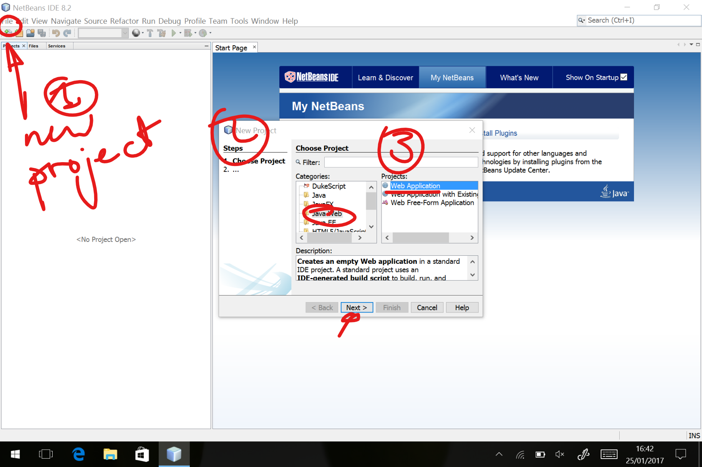

Ahora le damos un nombre al proyecto y seleccionamos dónde queremos
guardarlo en nuestro disco duro. Pulsamos **Next**.

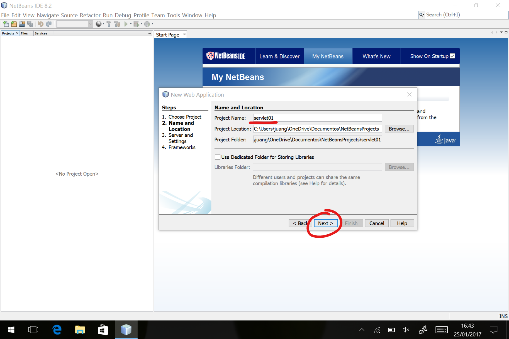

### Selección del contenedor(servidor) J2EE.

Como es una aplicación J2EE, necesitamos instalar un servidor de aplicaciones. Por defecto NetBeans ofrece GlassFish, pero nosotros vamos a ver aquí:

[Apache Tomcat ](https://tomcat.apache.org) 

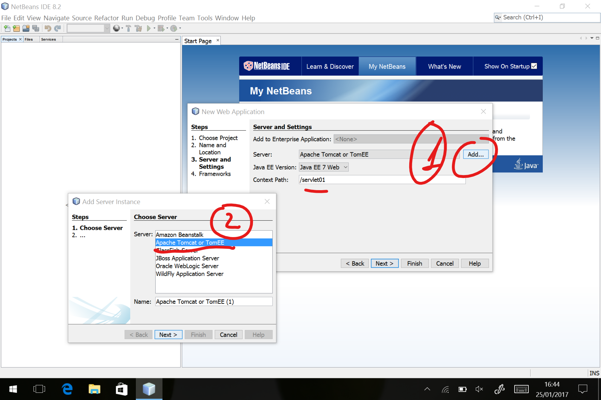

### Descarga e instalación de Tomcat.

Antes de continuar, deberemos [descargar y configurar Apache Tomcat de su Web oficial ](http://tomcat.apache.org/download-80.cgi#8.5.11). 

En nuestro caso nos decantamos por la versión 8.5.XX.

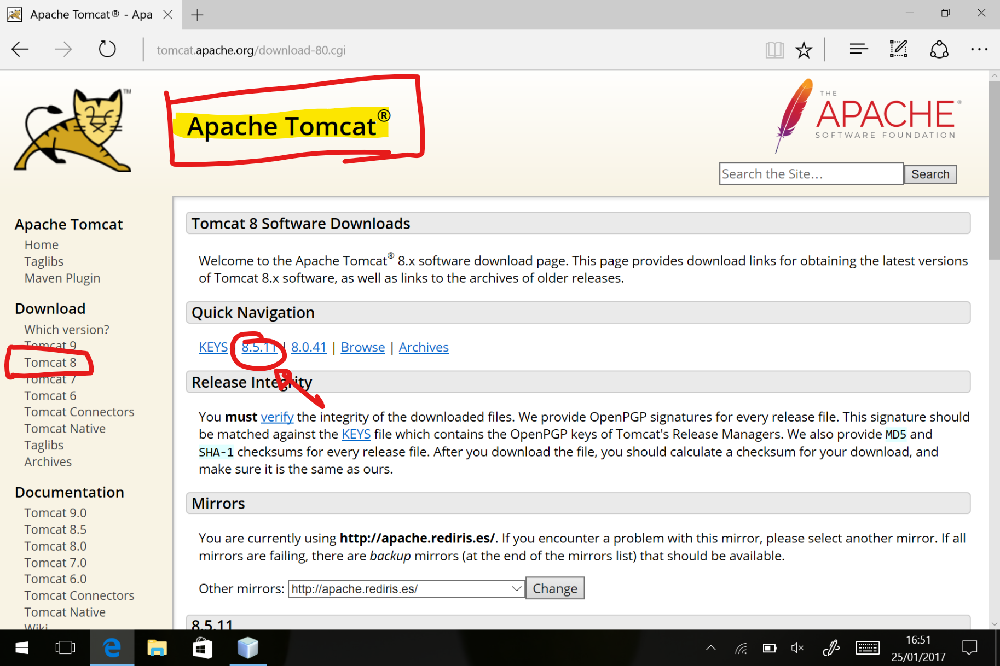

Seleccionamos el "tar.gz" si estamos en un sistema \*NIX o MAC y el ZIP en Windows.

Descargamos y descomprimimos en nuestra carpeta de trabajo. No es necesaria instalación y es mejor así para mantener el equipo más limpio.

Si quieres desacerte de Tomcat al terminar el tutorial, sólo has de eliminar la carpeta y ¡listo!.

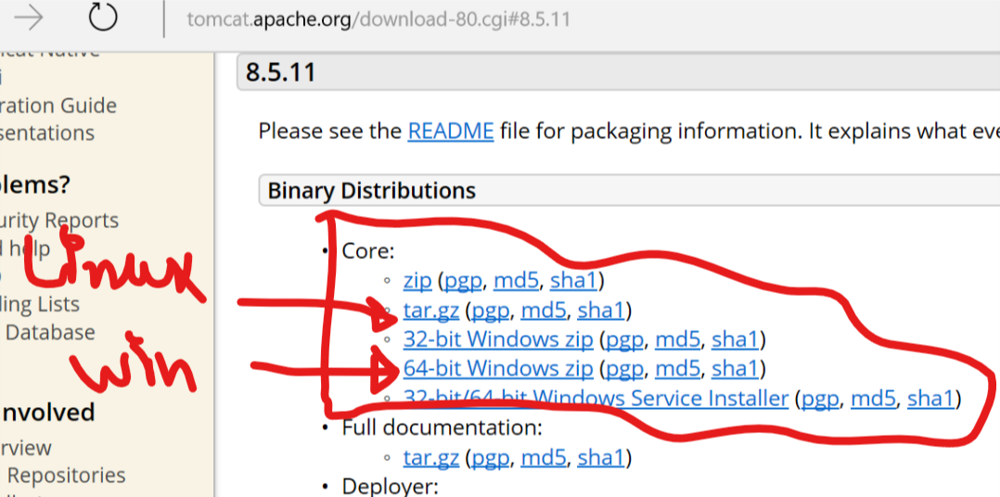

Una vez descomprimido, hemos de configurar el acceso de administrador para poder subir aplicaciones (ficheros WAR) al servidor. Para ello editamos el fichero **tomcat-users.xml** que está en la carpeta **_conf_**.

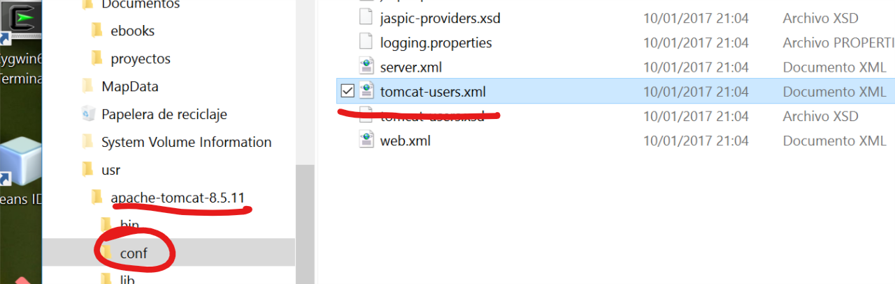

Añadimos la siguiente línea en el fichero **tomcat-users.xml**. Asegúrate de hacerlo dentro del nodo raíz "tomcat-users" del fichero XML:

```xml
<user username="tomcat" password="tomcat" roles="admin, manager-gui"/>
```

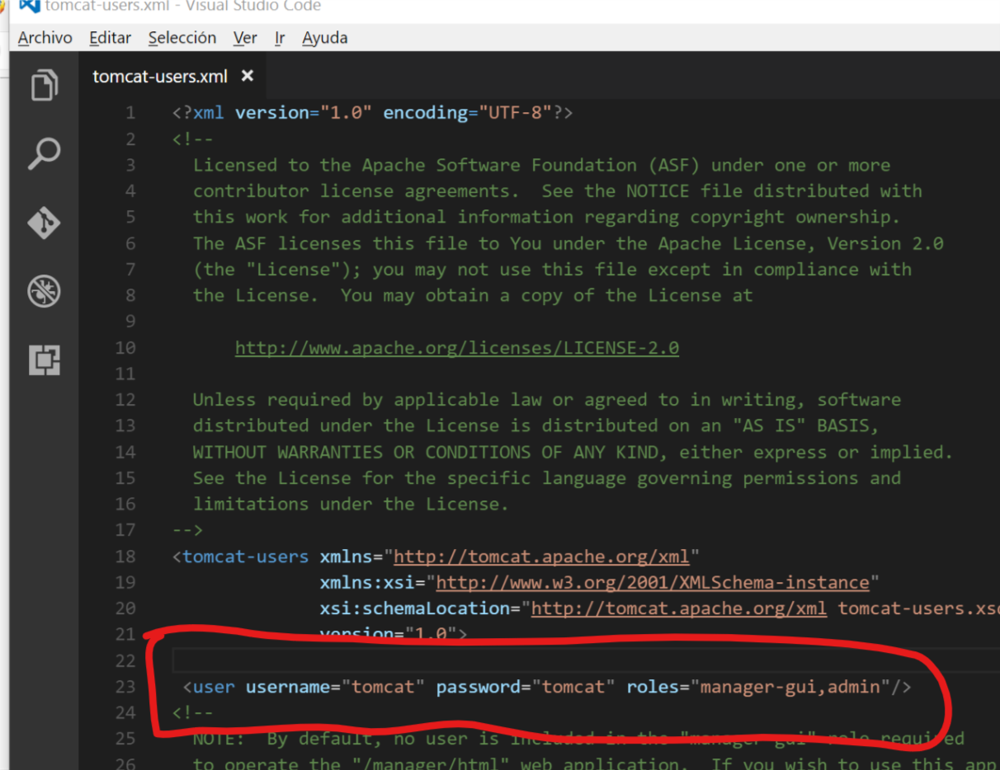

### Introducimos en NetBeans el usuario y contraseña de Tomcat

Continuamos con el proyecto: indicamos a NetBeans el directorio donde hemos descargado y configurado Tomcat así como el usuario y contraseña  para el acceso al servidor de aplicaciones.

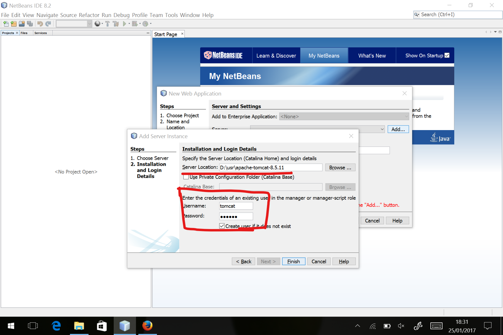

### Estructura de nuestro proyecto Web con Servlets

En el directorio _**Web Pages**_ podemos colgar cualquier elemento estático que necesitemos (código JavaScript, CSS, formularios estáticos, etc.).

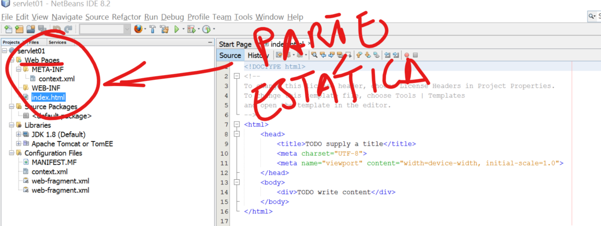

### Añadiendo el primer servlet

El fichero web.xml:

```xml
    <!-- Página por defecto si no ponemos nada -->
    <welcome-file-list>
        <welcome-file>index.jsp</welcome-file>
    </welcome-file-list>
    
    <!-- Servlet para la gestión de usuarios -->
    <servlet>
         <!-- Es como una variable, le asigno un nombre 
            a una clase que es la que contiene mi servlet -->
        <servlet-name>HorarioManagement</servlet-name>
        <!-- Aquí le damos la ruta completa (classpath), 
            incluyendo el paquete -->
        <servlet-class>com.iesvdc.acceso.simplecrud.controller.HorarioManagement</servlet-class>
    </servlet>
    <!-- Mapeo Ruta <===> Servlet -->
    <servlet-mapping>
        <servlet-name>HorarioManagement</servlet-name>
        <!-- Ruta en el servicio Web -->
        <url-pattern>/user</url-pattern>
        <url-pattern>/user/*</url-pattern>
    </servlet-mapping>
 ```

Ejemplo de un servlet:

```java
package com.iesvdc.acceso.simplecrud.controller;

import java.io.IOException;

import javax.servlet.ServletException;
import javax.servlet.http.HttpServlet;
import javax.servlet.http.HttpServletRequest;
import javax.servlet.http.HttpServletResponse;

public class horarioManagement extends HttpServlet {

    @Override
    public void init() throws ServletException {

    }

    // LEER
    @Override
    protected void doGet(HttpServletRequest req, // parámetros de la petición
            HttpServletResponse resp) // respuesta que genero
            throws ServletException, IOException {

    }

    // CREAR
    @Override
    protected void doPost(HttpServletRequest req, // parámetros de la petición
            HttpServletResponse resp) // respuesta que genero
            throws ServletException, IOException {

    }

    // ACTUALIZAR
    @Override
    protected void doPut(HttpServletRequest req, // parámetros de la petición
            HttpServletResponse resp) // respuesta que genero
            throws ServletException, IOException {

    }


    // BORRAR
    @Override
    protected void doDelete(HttpServletRequest req, // parámetros de la petición
            HttpServletResponse resp) // respuesta que genero
            throws ServletException, IOException {

    }

    @Override
    public void destroy() {

    }
    
}
```
