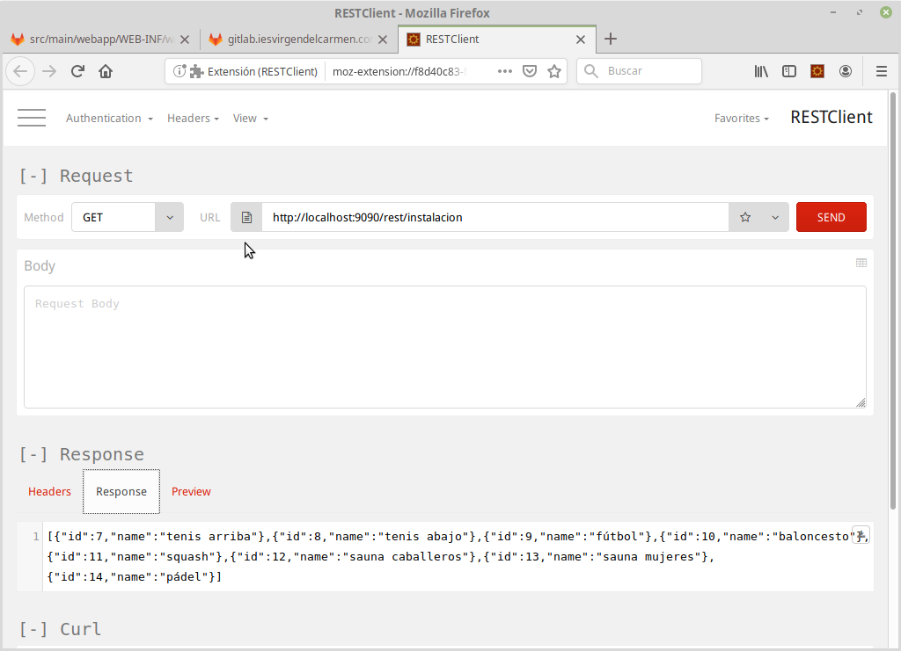

# WS: Servicios REST

Hasta ahora hemos visto un enfoque tradicional (formularios con métodos GET y POST) y un enfoque híbrido (métodos GET, POST, PUT y DELETE) con algo de JavaScript.

Otro enfoque a la hora de diseñar aplicaciones para la Web es la filosofía SAP (Single Application Page), donde usamos todas las características del modelo de cajas de HTML5.

## Single Application Page

Se trata de tener una aplicación HTML5+JS donde existen varias cajas ocultas que contienen las diferentes vistas de la aplicación. En cada momento vamos cambiando de una a otra según un menú principal que hace de controlador para activar/desactivar vistas.

La aplicación se comunica con un servicio REST con verbos HTTP (ej. GET/POST/PUT/DELETE).

Vamos a implementar las siguientes rutas y verbos HTTP:


|	Descripción 							| Verbo HTTP 	| ruta						| 
|---										|--- 			|--- 						|
| Listar todas las instalaciones			| GET			| /api/instalacion		    |
| Ver el detalle de una instalación			| GET			| /api/instalacion/{id}	|
| Crear una nueva instalación				| POST			| /api/instalacion			|
| Borrar una instalación					| DELETE		| /api/instalacion/{id}	|
| Buscar una instalación por nombre  	    | GET			| /api/instalacion/nombre/{nombre}			|

Veremos este apartado con más detalle en la siguiente clase.

## Creación de un WebService con Tomcat y Jersey

Jersey es un Servlet (aplicación) genérica a la que le indicamos el paquete o clase que queremos exponer a nuestro servicio y **automágicamente** se encarga de hacerlo.

### Añadiendo las dependencias al proyecto

Para poder usar Jersey, primero hemos de añadir las dependencias necesarias en nuestro pom.xml. 

Necesitamos JAXB como marshaller/unmarshaller (artefactos jaxb*), esto nos convierte de objeto plano Java a una interpretación XML (en memoria).

Jersey dispone de tres partes:
 
1. Conector JAXB: Interpreta las representaciones internas JAXB (marshaller/unmarshaller)
2. Generador de JSON: Convierte las representaciones internas de/hacia JSON
3. Servlet: El sel servicio propiamente dicho (habrá que añadir una entrada en el web.xml a tal efecto).

```xml
    <dependency>
      <groupId>javax.xml.bind</groupId>
      <artifactId>jaxb-api</artifactId>
      <version>2.3.0</version>
    </dependency>

    <dependency>
      <groupId>com.sun.xml.bind</groupId>
      <artifactId>jaxb-core</artifactId>
      <version>2.3.0</version>
    </dependency>

    <dependency>
      <groupId>com.sun.xml.bind</groupId>
      <artifactId>jaxb-impl</artifactId>
      <version>2.3.0</version>
    </dependency>


    <dependency>
      <groupId>javax.activation</groupId>
      <artifactId>activation</artifactId>
      <version>1.1.1</version>
    </dependency>
    
    <dependency>
      <groupId>org.glassfish.jersey.media</groupId>
      <artifactId>jersey-media-jaxb</artifactId>
      <version>2.25.1</version>
    </dependency>
    <dependency>
        <groupId>org.glassfish.jersey.media</groupId>
        <artifactId>jersey-media-json-jackson</artifactId>
        <version>2.25.1</version>
    </dependency>
    <dependency>
      <groupId>org.glassfish.jersey.containers</groupId>
      <artifactId>jersey-container-servlet-core</artifactId>
      <version>2.25.1</version>
    </dependency>
```

### Creando el POJO

Para que podamos trabajar con JAXB, necesitamos trabajar con objetos Java sencillos. Ejemplo:

```java
package com.iesvdc.acceso.simplecrud.model;

public class Instalacion {
    
    private int id;
    private String name;

    public Instalacion(){}

    public Instalacion(String name) {
        this.name = name;
    }
    
    public Instalacion(int id, String name) {
        this.id = id;
        this.name = name;
    }

    public int getId() {
        return id;
    }

    public void setId(int id) {
        this.id = id;
    }

    public String getName() {
        return name;
    }

    public void setName(String name) {
        this.name = name;
    }
    
}
```

### Patrón DAO

Usaremos el patrón DAO (Data Access Object) para crear una clase que se encargue de salvar el *desfase objeto-relacional*. Ejemplo:


```java
/*
 * To change this license header, choose License Headers in Project Properties.
 * To change this template file, choose Tools | Templates
 * and open the template in the editor.
 */
package com.iesvdc.acceso.simplecrud.model;

import java.sql.Connection;
import java.sql.PreparedStatement;
import java.sql.ResultSet;
import java.sql.SQLException;
import java.util.ArrayList;
import java.util.List;

import javax.naming.Context;
import javax.naming.InitialContext;
import javax.sql.DataSource;

/**
 *
 * @author juangu
 */
public class InstalacionDAO {
    // CRUD, findAll, finById, count
    Connection conn;

    public InstalacionDAO(){
        conn = new Conexion().getConnection();
    }

    public InstalacionDAO(Connection conexion){
        this.conn=conexion;
    }

    public boolean create(Instalacion instala){
        boolean exito=true;
        try {        
            // Conexion conexion = new Conexion();    
            // Connection conn = conexion.getConnection();
            String sql = 
                "INSERT INTO instalacion VALUES (NULL,?,?)";
            PreparedStatement pstmt = conn.prepareStatement(sql);
            pstmt.setInt(1, instala.getId());
            pstmt.setString(2, instala.getName());
            pstmt.executeUpdate();  
            // conn.close();
        } catch (SQLException ex) {
            System.out.println("ERROR:  "+ex.getMessage());
            exito = false;
        } 
        return exito;
    }
    
    public Instalacion findById(Integer id){
        Instalacion instala;
        try {
            String sql = 
                "SELECT * FROM instalacion WHERE id=?";
            PreparedStatement pstmt = conn.prepareStatement(sql);
            pstmt.setInt(1, id);
            System.err.println("\nID:: "+id+"\n");
            ResultSet rs  = pstmt.executeQuery();
            rs.next();
           instala = new Instalacion(
                rs.getInt("id"),
                rs.getString("nombre"));                    
            // conn.close();
        } catch (SQLException ex) {
           instala = null;
        } 
        return instala;
    } 
    
    public List<Instalacion> findAll() {
        Instalacion instala;
        List<Instalacion> li_ins = new ArrayList();
        try {            
            
            String sql = "SELECT * FROM instalacion";
            
            PreparedStatement pstmt = conn.prepareStatement(sql);
            
            ResultSet rs  = pstmt.executeQuery();
            // recorro el resultset mientras tengo datos
            while (rs.next()){
               instala = new Instalacion(
                    rs.getInt("id"),
                    rs.getString("nombre"));
                li_ins.add(instala);
            }
            // cerramos la conexión
            // conn.close();
        } catch (SQLException ex) {
            System.out.println("ERROR"+ ex.getMessage());
            li_ins = null;
        } 
        return li_ins;
    }
    
    
    /**
     * Este método busca Instalacions en la BBDD por nombre:
     * @param nombre
     * El nombre a buscar
     * @return 
     * Devuelve:
     * null: si hayinstalagún error (no se puede conectar a la BBDD...). <br>
     * ArrayList vacío (length == 0): si no hay nadie con ese nombre. <br>  
     * ArrayList con Instalacions: si hayinstalaumnos con ese nombre.<br>
     */
    public List<Instalacion> findByNombre(String nombre){
        Instalacion instala;
        List<Instalacion> li_ins = new ArrayList();
        try {            
            // conectamos a la BBDD
            Conexion conexion = new Conexion();    
            Connection conn = conexion.getConnection();
            // esta es la cadena SQL de conslulta
            String sql = "SELECT * FROM instalacion WHERE nombre=?";
            // usamos este objeto porque es más seguro
            PreparedStatement pstmt = conn.prepareStatement(sql);
            pstmt.setString(1, nombre);
            // ejecutar la consulta contra la base de datos y 
            // devuelve el resultado en el ResultSet (parecido a 
            // un Array con iterador
            ResultSet rs  = pstmt.executeQuery();
            // recorro el resultset mientras tengo datos
            while (rs.next()){
               instala = new Instalacion(
                    rs.getInt("id"),
                    rs.getString("nombre"));
                li_ins.add(instala);
            }
            // cerramos la conexión
            conn.close();
        } catch (SQLException ex) {
            System.out.println("ERROR"+ ex.getMessage());
            li_ins = null;
        } 
        return li_ins;
    }
    
        
   
    
    /**
     * Este método actualiza uninstalaumno en la BBDD
     * @param old_al
     * El objeto que contiene los datos antiguos delinstalaumno 
     * @param new_al
     * El objeto que contiene los datos nuevos delinstalaumno 
     * @return 
     * true si se lleva a cabo correctamente <br>
     * false si no se actualiza nada (error de conexión, no 
     * estaba elinstalaumno en la BBDD...) <br>
     */
    public boolean update(Instalacion old_al, Instalacion new_al) {
        
        return update(old_al.getId(),new_al);
    }
    
    /**
     * Este método actualiza una instalación en la BBDD
     * @param old_id
     * El id antiguo delinstalaumno 
     * @param new_al
     * El objeto que contieneinstalainstalaumno actualizado
     * @return 
     * true si se lleva a cabo correctamente <br>
     * false si no se actualiza nada (error de conexión, no 
     * estaba elinstalaumno en la BBDD...) <br>
     */
    public boolean update(Integer old_id, Instalacion new_al) {
        boolean exito=true;
        try {            
            Conexion conexion = new Conexion();    
            Connection conn = conexion.getConnection();
            String sql = 
                "UPDATE instalacion SET id=?, nombre=? WHERE id=?";
            PreparedStatement pstmt = conn.prepareStatement(sql);
            pstmt.setInt(3, old_id);
            pstmt.setInt(1, new_al.getId());
            pstmt.setString(2, new_al.getName());
            if (pstmt.executeUpdate()==0) {
                exito = false;
            }
            conn.close();
        } catch (SQLException ex) {
            exito = false;
        } 
        return exito;
    }
    
    /**
     * Este método borra de la BBDD el Instalacion cuyos datos 
     * coinciden con los de el objeto que se le pasa como 
     * parámetro
     * @paraminstalainstalaumno a borrar
     * @return 
     * true si borra uninstalaumno <br>
     * false si elinstalaumno no existe o no se puede conectar a la BBDD <br>
     */
    public boolean delete(Instalacion instala){        
        return delete(instala.getId());
    }
    
    public boolean delete(Integer id_al){
        boolean exito=true;
        try {            
            Conexion conexion = new Conexion();    
            Connection conn = conexion.getConnection();
            String sql = "DELETE FROM instalacion WHERE id=?";
            PreparedStatement pstmt = conn.prepareStatement(sql);
            pstmt.setInt(1, id_al);
            if (pstmt.executeUpdate()==0) {
                exito = false;
            }
            conn.close();
        } catch (SQLException ex) {
            exito = false;
        } 
        return exito;
    }
    
}

```

### El servicio web (WS)

Primero creamos el recurso que usará Jersey:

```java

package com.iesvdc.acceso.simplecrud.controller.service;

import com.iesvdc.acceso.simplecrud.model.*;

import java.util.ArrayList;
import java.util.List;
import java.util.logging.Logger;
import javax.ws.rs.Consumes;
import javax.ws.rs.GET;
import javax.ws.rs.POST;
import javax.ws.rs.PUT;
import javax.ws.rs.DELETE;
import javax.ws.rs.Path;
import javax.ws.rs.PathParam;
import javax.ws.rs.Produces;
import javax.ws.rs.core.MediaType;
import javax.ws.rs.core.Response;

/**
 *
 * @author Juangu <jgutierrez at iesvirgendelcarmen.coms>
 */
@Path("/")
public class InstalacionResource {

    @GET
    @Path("instalacion")
    @Produces({MediaType.APPLICATION_JSON, MediaType.APPLICATION_XML})
    public List<Instalacion> getInstalacions() {
        InstalacionDAO al_dao = new InstalacionDAO();
        List<Instalacion> list_al;
        try {
            list_al = al_dao.findAll();
        } catch (Exception ex) {
            list_al = new ArrayList<>();
            Logger.getLogger(ex.getLocalizedMessage());
        }
        return list_al;
    }

    @GET
    @Path("instalacion/{id}")
    @Produces({MediaType.APPLICATION_JSON, MediaType.APPLICATION_XML})
    public Instalacion getInstalacionById(@PathParam("id") String id) {
        InstalacionDAO al_dao = new InstalacionDAO();
        Instalacion al;
        try {
            al = al_dao.findById(Integer.parseInt(id));
        } catch (Exception ex) {
            al = new Instalacion(-1, "Error");
            Logger.getLogger(ex.getLocalizedMessage());
        }
        return al;
    }

    
    @GET
    @Path("instalacion/nombre/{nombre}")
    @Produces({MediaType.APPLICATION_JSON, MediaType.APPLICATION_XML})
    public List<Instalacion> getInstalacionByNombre(@PathParam("nombre") String nombre) {
        InstalacionDAO al_dao = new InstalacionDAO();
        List<Instalacion> list_al;
        try {
            list_al = al_dao.findByNombre(nombre);
        } catch (Exception ex) {
            list_al = new ArrayList<>();
            Logger.getLogger(ex.getLocalizedMessage());
        }
        return list_al;
    }


    @PUT
    @Path("instalacion/{id}")
    @Consumes({MediaType.APPLICATION_JSON, MediaType.APPLICATION_XML})
    public void updateInstalacion(@PathParam("id") Integer id, Instalacion al) {
        InstalacionDAO al_dao = new InstalacionDAO();
        try {
            al_dao.update(id, al);
        } catch (Exception ex) {
            Logger.getLogger(ex.getLocalizedMessage());
        }
    }

    
    @POST
    @Consumes({MediaType.APPLICATION_JSON, MediaType.APPLICATION_XML})
    @Produces({MediaType.APPLICATION_JSON, MediaType.APPLICATION_XML})
    @Path("alumno")
    public Response createInstalacion(Instalacion al) {
        InstalacionDAO al_dao = new InstalacionDAO();
        try {
            al_dao.create(al);
        } catch (Exception ex) {
            Logger.getLogger(ex.getLocalizedMessage());
            return Response.status(400).entity(al).build();
        }
        return Response.status(200).entity(al).build();
    }
    
    @DELETE
    @Path("instalacion/{id}")
    public void deleteInstalacion(@PathParam("id") Integer id) {
        InstalacionDAO al_dao = new InstalacionDAO();
        try {
            al_dao.delete(id);
        } catch (Exception ex) {
            Logger.getLogger(ex.getLocalizedMessage());
        }
    }
}

```

Ahora hay que modificar el archivo **web.xml** para dar de alta el servlet Jersey en la ruta *"/rest"*:

```xml
    <servlet>
        <servlet-name>jersey-servlet</servlet-name>
        <servlet-class>org.glassfish.jersey.servlet.ServletContainer</servlet-class>
        <init-param>
            <param-name>jersey.config.server.provider.packages</param-name>
            <param-value>com.iesvdc.acceso.simplecrud.controller.service</param-value>
        </init-param>
        <init-param>
            <param-name>com.sun.jersey.api.json.POJOMappingFeature</param-name>
            <param-value>true</param-value>
        </init-param>
        <load-on-startup>1</load-on-startup>
    </servlet>
    <servlet-mapping>
        <servlet-name>jersey-servlet</servlet-name>
        <url-pattern>/rest/*</url-pattern>
    </servlet-mapping>
```

### Probando el servicio

Hasta que tengamos el frontend, podemos hacer nuestros tests con la extensión de Mozilla Firefox. "REST Client".


